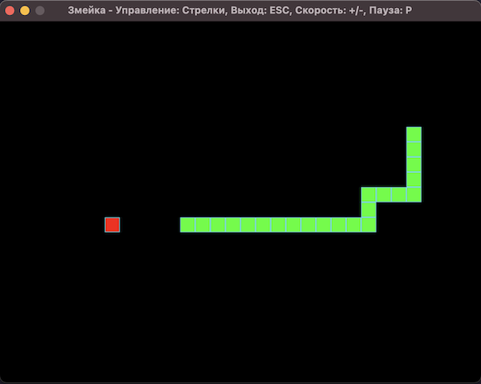

# Змейка

<p align="center">
  
</p>


## Установка 
Скачайте установочный пакет Python 3 с официального сайта и установите его, если он не был установлен ранее.

Для установки библиотеки Pygame выполните следующую команду в терминале:
```
pip3 install pygame
```
## Запуск приложения
Скачайте исходный код из репозитория и запустите файл так же, как любой другой файл Python (.py).
```
python3 the_snake.py
```
## Стек технологий
[](https://www.pygame.org)
[](https://www.python.org)

### Автор
[Elvira Ahmedyanova - Elyablack](https://github.com/Elyablack)
